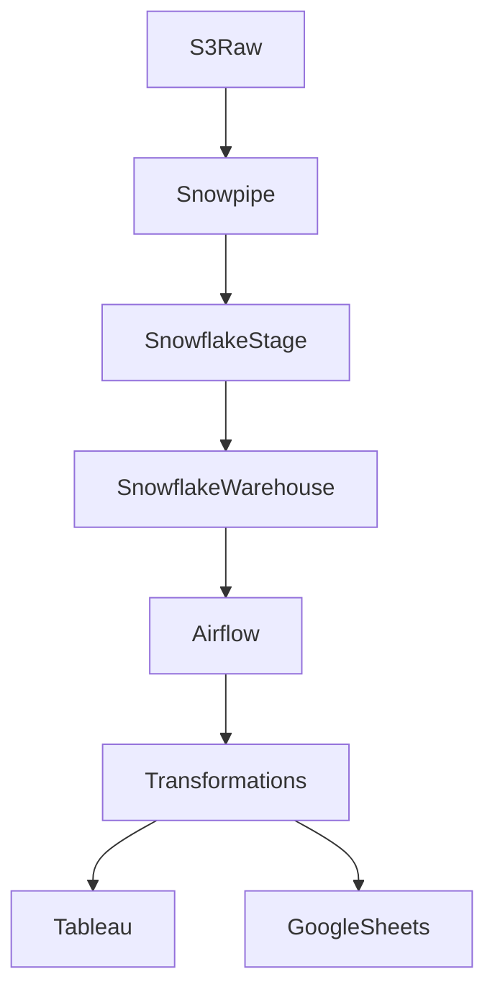

# 🏡 AWS Snowflake Real Estate Anomaly & Trend Analysis (Tableau)

An end-to-end **cloud + analytics pipeline** analyzing Florida’s housing market (2012-2025). It integrates **AWS S3, Snowpipe, Snowflake, and Airflow** for scalable data warehousing, applies **statistical anomaly detection** in Python & Google Sheets, and delivers **interactive Tableau dashboards** for anomaly and trend exploration.  

📌 LinkedIn Walkthrough: [LinkedIn Post](https://www.linkedin.com/feed/update/urn:li:activity:7372969898106363904/)  

---  

## 📌 Navigation  

| Section | Link |  
|---------|------|  
| **Problem Statement** | [Go to Problem Statement](#-problem-statement) |  
| **Part 1 - Data Analysis** | [Go to Data Analysis](#-part-1-data-analysis---anomaly--trend-exploration) |  
| **Notebook Breakdown** | [Open Notebook](#-notebook-breakdown-colab) |  
| **Tableau Dashboard** | [View Dashboard](#-tableau-dashboard) |  
| **Part 2 - Data Engineering** | [Go to Data Engineering](#-part-2-data-engineering---aws-snowflake-pipeline) |  
| **Recommendations** | [Go to Recommendations](#-recommendations) |  
| **Outcome** | [Go to Outcome](#-outcome) |  

---  

## 💡 Project Overview  

This pipeline:  
- Processes **9.12M rows** from AWS S3 to Snowpipe to Snowflake.  
- Warehouses data for **real estate insights** at scale.  
- Builds interactive Tableau dashboards on **73K+ rows and 62 columns**, visualizing **month-over-month (MoM) and year-over-year (YoY)** housing trends in prices, sales, and inventory for Florida (2012-2025).  
- Applies anomaly detection (Z-Score, IQR, Correlation) to uncover:  
  - Housing price spikes  
  - Inventory dips  
  - Regional disparities  

---  

## 🎯 Problem Statement  

The Florida housing market (2012-2025) shows **volatile inventory, surging prices, and shifting demand**. Stakeholders need to:  
- Detect **anomalies** like unsustainable spikes or dips.  
- Model **trends** in affordability, supply, and competition.  
- Use these insights to support **investment, policy, and buyer decisions**.  

---  

## 🔹 Part 1: Data Analysis - Anomaly & Trend Exploration  

### 📊 Dataset  
- 9.12M rows ingested from AWS S3 to Snowflake.  
- 73K+ rows curated for Tableau.  
- 62 columns including:  
  - `PERIOD_BEGIN`, `PERIOD_END`, `REGION`, `STATE`, `ZIPCODE`  
  - `MEDIAN_SALE_PRICE`, `MEDIAN_LIST_PRICE`, `INVENTORY`, `HOMES_SOLD`  
  - `DAYS_ON_MARKET`, `SOLD_ABOVE_LIST`  

### 🧪 Statistical Techniques  

- **Z-Score (Price anomalies)**
  ```excel
  =(F2 - Stats!B7)/Stats!B8
  ```
  **Explanation:** Measures how far the price in F2 deviates from the mean (Stats!B7) in terms of standard deviations (Stats!B8). High absolute values indicate potential anomalies.

- **IQR (Inventory outliers)**
  ```excel
  =IF(OR(H2<Stats!B4,H2>Stats!B5),"Outlier","")
  ```
  **Explanation:** Flags inventory values in H2 that fall outside the interquartile range bounds (Stats!B4 = Q1-1.5*IQR, Stats!B5 = Q3+1.5*IQR) as “Outlier”.

- **Correlation analysis**
  ```excel
  =CORREL(Sheet1!F2:F,Sheet1!H2:H)   # Price vs Inventory
  =CORREL(Sheet1!H2:H,Sheet1!G2:G)   # Inventory vs List Price
  ```
  **Explanation:** Computes linear correlation between two variables.

  **Breakdown:**
  - `CORREL(array1, array2)` → returns a correlation coefficient between -1 and 1.
  - `Sheet1!F2:F` → range of actual prices.
  - `Sheet1!H2:H` → range of inventory counts.
  - `Sheet1!G2:G` → range of list prices.

  **Interpretation:**
  - +1 → perfect positive correlation.
  - 0 → no correlation.
  - -1 → perfect negative correlation.

  **Use in context:**
  - Price vs Inventory → see if higher prices reduce stock levels.
  - Inventory vs List Price → check if inventory is stocked more for higher list prices.


### 🔎 Trend Findings  

- **Inventory**: -8.04% MoM decline.  
- **Median Sale Price**: +52.84% MoM increase.  
- **Homes Sold Above List**: +11.92% MoM increase.  
- **Days on Market (DOM)**: Declining steadily.  
- **Price per SqFt**: Rising post-2019.  
- **County-level**: Hillsborough and Pinellas are more volatile than Hernando and Pasco.  

---  

## 📝 Notebook Breakdown (Colab)  

📂 Colab Notebook: [Open in Google Colab](https://colab.research.google.com/drive/18kiVhsU590WE-r9vlG_66oFGpS2-aoJ7?usp=sharing)  

The notebook covers:  
- Data ingestion and cleaning.  
- Transformation into analysis-ready tables.  
- Price trend modeling (MoM and YoY).  
- Outlier detection using Z-Score and IQR.  
- Correlation between price, list price, and inventory.  
- County-level comparisons for volatility and growth.  

---  

## 📸 Tableau Dashboard  
  

📊 Tableau Visualization: [Florida Market Analysis](https://public.tableau.com/views/FlordiaMarketAnalysis/Dashboard1?:language=en-US&:sid=&:redirect=auth&:display_count=n&:origin=viz_share_link)  

**Features**:  
- KPIs for inventory, sale price, and DOM.  
- Trends in price per sqft, homes sold above list, and inventory.  
- County and zip code drilldowns.  
- Clear anomaly highlights such as **2021-22 price surges** and **2023 inventory dip**.  

---  

## 🔮 Recommendations  

- **Policy makers**: Monitor price surges and inventory dips to preempt affordability crises.  
- **Investors**: Target volatile counties (Hillsborough, Pinellas) for short-term gains and stable ones (Pasco, Hernando) for long-term stability.  
- **Buyers**: Enter the market when DOM trends down and inventory rebounds.  
- **Analysts**: Use correlation insights to forecast price-inventory dynamics.

---  

## 🔹 Part 2: Data Engineering - AWS Snowflake Pipeline  

### 🏗️ Architecture  



### ⚙️ Workflow Steps  

#### 1. Raw Data Ingestion  
- Raw **TSV/CSV** exports from Redfin loaded into **AWS S3** (`real-estate-raw/`).  
- Partitioned by `region`, `year`, and `month` for scalability.  

#### 2. Snowpipe Continuous Loading  
- Snowpipe configured with **S3 event notifications** → triggers ingestion automatically.  
- Data lands in **Snowflake staging tables** with schema-on-write.  
- Handles millions of rows per batch with near real-time latency.  

Example:  
```sql
CREATE PIPE real_estate_pipe 
  AS COPY INTO real_estate_stage
  FROM @s3_real_estate_stage
  FILE_FORMAT = (TYPE = CSV FIELD_OPTIONALLY_ENCLOSED_BY='"');
```  

#### 3. Schema & Warehouse Design  
- **Star schema**:  
  - `fact_sales` (housing transactions: prices, inventory, DOM).  
  - `dim_region` (county, zip, state).  
  - `dim_date` (day, month, year).  
- Warehousing set to **Medium**, auto-suspend enabled for cost optimization.  

#### 4. Transformation Layer  
- Airflow DAG executes **SQL scripts** and **Python ETL tasks**:  
  - Deduplication and normalization.  
  - Enrich with **time-based features** (YoY, MoM).  
  - Pre-compute anomaly markers (z-scores, IQR flags).  

Example:  
```sql
CREATE OR REPLACE TABLE curated.real_estate_trends AS
SELECT 
  region,
  DATE_TRUNC('month', period_begin) AS month,
  AVG(median_sale_price) AS avg_sale_price,
  AVG(inventory) AS avg_inventory,
  (AVG(median_sale_price) - LAG(AVG(median_sale_price)) 
     OVER (PARTITION BY region ORDER BY month)) / 
     LAG(AVG(median_sale_price)) OVER (PARTITION BY region ORDER BY month) AS mom_growth
FROM staging.real_estate
GROUP BY region, month;
```  

#### 5. Airflow Orchestration  
- DAG scheduled **daily** to check for new files in S3 → trigger Snowpipe ingestion.  
- Dependencies enforce order: ingestion → transformation → anomaly export → dashboard refresh.  
- Error handling: retries with exponential backoff + Slack alerts.  

DAG Flow:  
```python
extract_data >> load_snowflake >> transform_trends >> export_anomalies >> refresh_tableau
```  

#### 6. Analytics Layer  
- **Curated Layer** feeds Tableau dashboards.  
- Anomaly-flagged extracts also exported to **Google Sheets** for formula-based validation.  

---

### 🔑 Highlights  
- Scalable ingestion: 9.12M rows handled via Snowpipe.  
- Optimized storage: partitioned + parquet compression lowers costs.  
- Production-ready orchestration: Airflow ensures reliability and automation.  
- Multi-platform analytics: Snowflake powers both Tableau and Sheets.  
  
---  

## ✅ Outcome  

- Built an **AWS to Snowflake to Tableau pipeline** on real estate data.  
- Processed 9.12M rows and visualized trends from 2012-2025.  
- Applied Z-Score, IQR, and correlation analysis to detect anomalies.  
- Produced Tableau dashboards for real-time anomaly and trend exploration.  
