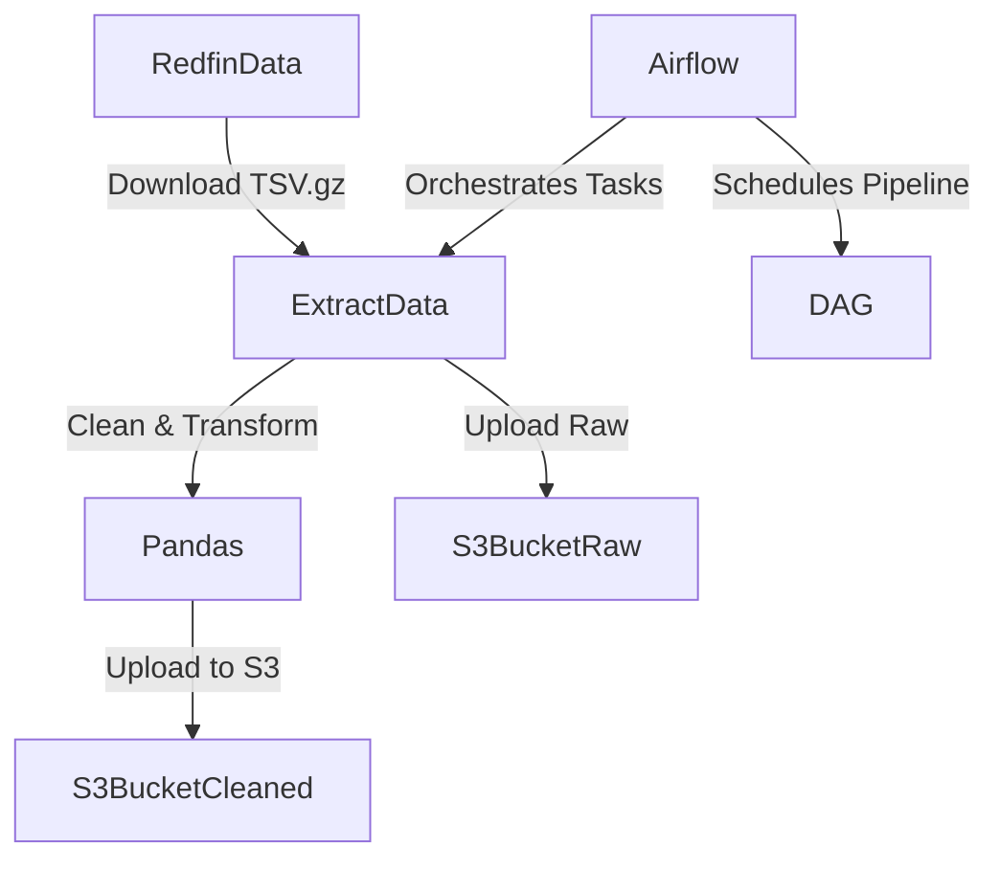

# 🏡 Real Estate Data Pipeline — Airflow | Pandas | AWS S3

A production-ready data pipeline using **Apache Airflow** for orchestration, **Pandas** for transformation, and **AWS S3** for data storage. This pipeline ingests raw real estate data from Redfin, transforms and cleanses it, and uploads structured CSV files to an S3 bucket.

---

## 💡 Project Overview

This pipeline:
- Extracts raw city-level real estate data from Redfin’s public data hub
- Cleans, selects, and enriches the dataset using Pandas
- Uploads the final dataset to an Amazon S3 bucket
- Designed to run in a production-friendly Airflow DAG on an EC2 instance

---

## 🤖 Why These Tools?

| Tool         | Why it’s used                                                                 |
|--------------|--------------------------------------------------------------------------------|
| **Airflow**  | Manages and schedules reliable, auditable workflows with dependency control   |
| **Pandas**   | Efficient data processing and transformation in Python                        |
| **AWS S3**   | Cloud-based object storage to archive raw and cleaned data                    |
| **EC2**      | Cost-effective compute to run ETL pipelines on demand                         |

---

## 📡 Architecture



---

## 📂 Directory Structure

```
redfin-real-estate-pipeline/
│
├── dags/
│   └── redflin_analytics.py        # Airflow DAG for extract-transform-load
├── EC2_Setup.sh                    # Shell script to set up EC2 for Airflow
├── snowflake_realestate.sql       # (Optional) Script for loading into Snowflake
└── README.md
```

---

## 🏷️ Transformed Columns

| Column                        | Description                              |
|------------------------------|------------------------------------------|
| period_begin, period_end     | Data range for the month                 |
| city, state                  | Location info                            |
| median_sale_price            | Median home sale price                   |
| inventory, homes_sold        | Housing supply and demand metrics        |
| months_of_supply             | Supply estimation metric                 |
| period_begin_in_years        | Extracted year from `period_begin`       |
| period_begin_in_months       | Extracted month name from `period_begin`|

---

## ⚙️ Setup Instructions

### 🔧 Prerequisites

- AWS Account with S3 access
- Ubuntu EC2 instance
- Python 3.10+
- Airflow installed and configured

### 1️⃣ Setup EC2 with Required Packages

Run:

```bash
bash EC2_Setup.sh
```

This installs:
- Apache Airflow
- Pandas & Boto3
- AWS CLI
- Creates a Python virtual environment

### 2️⃣ Configure AWS

```bash
aws configure
```

Provide IAM credentials that have S3 access to:
- `store-raw-data-yml` (Raw data bucket)
- `redfin-transform-zone-yml` (Cleaned data bucket)

---

## 🚀 Run the Pipeline

Trigger your DAG in Airflow:

1. Start Airflow:
```bash
airflow standalone
```

2. Access Airflow UI at [http://localhost:8080](http://localhost:8080)

3. Trigger the DAG: `redfin_analytics_dag`

---

## 🌀 Airflow DAG Logic

### `redflin_analytics.py`

```python
extract_redfin_data = PythonOperator(
    task_id='tsk_extract_redfin_data',
    python_callable=extract_data,
    op_kwargs={'url': url_by_city}
)

transform_redfin_data = PythonOperator(
    task_id='tsk_transform_redfin_data',
    python_callable=transform_data
)

load_to_s3 = BashOperator(
    task_id='tsk_load_to_s3',
    bash_command='aws s3 mv {{ ti.xcom_pull("tsk_extract_redfin_data")[0]}} s3://store-raw-data-yml'
)

extract_redfin_data >> transform_redfin_data >> load_to_s3
```

---

## ✅ Sample Output

```text
| city           | state       | median_sale_price | homes_sold | period_begin_in_months |
|----------------|-------------|-------------------|------------|--------------------------|
| Everett        | Washington  | 330000.0          | 13         | May                      |
| Daytona Beach  | Florida     | 99000.0           | 111        | Dec                      |
```

---

## 🧪 Transformation Logic

```python
df['period_begin'] = pd.to_datetime(df['period_begin'])
df["period_begin_in_years"] = df['period_begin'].dt.year
df["period_begin_in_months"] = df['period_begin'].dt.month
month_dict = {1: "Jan", 2: "Feb", 3: "Mar", ..., 12: "Dec"}
df["period_begin_in_months"] = df["period_begin_in_months"].map(month_dict)
```

---

## 🔐 Security Best Practices

- Never hardcode credentials — use AWS profiles or IAM roles
- Use `.env` or secrets managers in production
- Rotate S3 access keys regularly

---

## 📌 License

MIT License — free to use, modify, and distribute.
